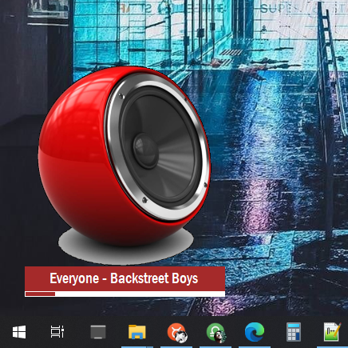

#  Kookie3 

> Kookie3 Media Player with un4seen BASS audio library

##  About

Kookie3 is a stylish media player with sleek looks and minimalist UI. Kookie3 is **portable** and has **flexible UI**. It is designed to be used as a gadget which sits on top of other windows. Kookie3 includes visually appealing features like RGB-hue-Shift, Transperancy and Opacity control and custom animated backgrounds.

Based on [un4seen BASS audio library](https://www.un4seen.com/).
Supported for windows7 and above. Requires .NET framework 4.8 or above.

##  Kookie3 Customized Interface

Simple design of Kookie3 makes its interface simple to customize. The main UI has just 3 components:
1. Lable
2. Seekbar
3. Album-art

Checkout some interface setting below.
___

 **Transparent UI with opacity control**
___

 **Resize UI and Dock seekbar & art as you like**
___

 **Minimal UI with only a seekbar**
___

 **Multi-Line Lable with TV-style UI**
___

 **Fully Transparent Docked Player**
___

 **Solid Lable with transparent art**
___

 **Fully Solid (opaque) UI**
___

 **Auto color matching UI** : Note - color matching is b/w art background and label background, this works during Hue shift as well.
___

 **No Lable UI**
___

 **Full Hue shift with RGB effects** : turn on *Hue Shift* in settings
___

##  Installation

Kookie3 is stand-alone, no installation required. You can compile from source code or use pre-compiled binaries available in zip format.

* [Download](https://github.com/Nelson-iitp/Kookie3/raw/main/Kookie3/Kookie3.zip) and Extract zip

* Run `Kookie3.exe` executable, **drag-drop** files to play

* Press 'L' to view library and 'P' to view playlist
___

 **Note:**
* make sure BASS related dlls `bass.dll` and `Bass.Net.dll` are in the same directory as the executable `Kookie3.exe`

* on the first run, you shall be prompted to create a **default library** - click yes to create default library
	
	* you must have a default library which is just a text file `k3.lib` created under app directory
	* also, default settings file `k3.ini` will be created under app directory on first run

* After creating settings and library file, Kookie3 default interface will show up.
* Note: By default, album-art or custom-backgroud-art is disabled/hidden. You can enable it under settings page.
	* **right-click** to see alt-menu and more setting
	

* click on '**Setting -> Show Configuration**' menu item to see settings window

* '**Art/Art_Default'** can be choosen to set app background
	* some app backgrounds are provided within, check the folder `k3art` under app directory
* '**Art/Art_Always_Show_Default'** can be turned **False** to show album art when available

* Alt-menu is available in the **System-Tray** as well

 **Note:**

If you can't find your UI on screen, due to various reasons such as:

* reducing opacity to zero
* reducing size to zero
* positioning outside working area
* making everything transparent or hiding everything (including labels and seekbar)
* sizing incorrectly wrt docking of elements

Then you can use Tray menu to first **'Focus'** on Kookie3 (so that it accepts input) and then choose any of the following:

* Use 'Center-Screen UI' `ctrl + C` - this brings the UI to center of the working screen
* Use 'Auto-Size UI' `ctrl + B` - this auto-sizes the UI based on size of its elements
* Reset Settings 
	* close running instance of Kookie3
	* go to app directory and delete the k3.ini file
	* start Kookie3 again - a default configuration file will be created
	* this will not disturb your libraries but reset only the UI preferences
	
Remeber to save all your prefered UI settings using 
* alt-menu->`Settings`->`Save As Config` or 
* shortcut `ctrl + shift + S`

and load it later using:
* alt-menu->`Settings`->`Load Config` or 
* shortcut `ctrl + O`

 **Note: Transparent UI**

To make UI transparent, go to settings `ctrl + E`
* Select a `Color_Transparent` - this color will be made the `TransperancyKey` of main UI
	* all colors matching this color will appear transparent

	
* Select the same `Color_Back` to make the background transparent or `Color_Fore` to make Labels Transparent
* **VERY IMPORTANT** : DO NOT SET TRANSPERANCY KEY TO PURE WHITE (255,255,255) OR PURE BLACK (0,0,0) as this may cause UI to misbehave.

 **Note: RGB Effect with Hue-Shifting**

To toggle Hue-Shifting use shortcut key `T`. 
Note that:
* Hue-shift works only when a media is **playing**. 
* Hue-shift can be enabled seperatly for background and foreground.
* The *angle* of shift (in radians) can be choosen in settings.
	* See more settings in `Setting/Others` section

	

___

##  UI Controls

Kookie3 is mainly focused on quick-keyboard shortcuts but all functionality can be accessed using mouse as well.

##  Mouse Controls
* seekbar can be clicked
* volume control with mouse wheel
* drag-drop to open files/folders - works on UI, Library and Playlist
* press and hold left-mouse-button to move window
* right-click to see alt-menu

##  Keyboard Controls

###  General

|Action----------------------------|Key----------------------------|
|:------|:------|
|Exit|Escape|
|Show Playlist|P|
|Show Library|L|
|Toggle File Drop Target|D|
|Show Settings|E|
|Show Devices|V|
|Reinitialize BASS device|Enter|
|Open App Directory|F2|
|Visit Website|F1|

###  Media Control

|Action----------------------------|Key----------------------------|
|:------|:------|
|Play/Pause|Space|
|Restart|ctrl + Space|
|Next/Prev Track|Right/Left|
|Seek +/-5 seconds|shift + Right/Left|
|Seek +/-30 seconds|ctrl + Right/Left|
|Seek +/-2 minutes|ctrl + shift + Right/Left|
|Volume +/-01|Up/Down|
|Volume +/-02|shift + Up/Down|
|Volume +/-05|ctrl + Up/Down|
|Volume +/-10|ctrl + shift + Up/Down|
|Mark As Favourite|F|
|Display media information|I|

###  Playlist Control

|Action----------------------------|Key----------------------------|
|:------|:------|
|Clear Playlist|ctrl + X|
|Shuffle Playlist Once|S|
|Toggle Repeat Single|R|
|Toggle Repeat All|shift + R|
|Toggle Reversed Playlist|ctrl + shift + R|

###  UI Size

|Action----------------------------|Key----------------------------|
|:------|:------|
|Width +/- 5px|shift + Add/Subtract|
|Width +/- 1px|shift + Multiply/Divide|
|Height +/- 5px|ctrl + Add/Subtract|
|Height +/- 1px|ctrl + Multiply/Divide|
|X-Axis +/- 1px|ctrl + shift + Add/Subtract|
|Y-Axis +/- 1px|ctrl + shift + Multiply/Divide|

###  UI Visibility

|Action----------------------------|Key----------------------------|
|:------|:------|
|Opacity +/- 5%|Add/Subtract|
|Opacity +/- 1%|Multiply/Divide|
|Toggle Hidden Label|H|
|Toggle Hidden Seekbar|ctrl + H|
|Toggle Hide in Taskbar|shift + H|
|Toggle TopMost|ctrl + T|
|Center Screen UI|ctrl + C|
|Center Screen UI if out of bounds|C|
|Auto-size UI|ctrl + B|

###  Misc

|Action----------------------------|Key----------------------------|
|:------|:------|
|Toggle Hue Shift|T|
|Choose Custom Default Art|A|
|Set Color as Background|shift + S|
|Load Config Changes|ctrl + O|
|Save Config Changes|ctrl + S|
|Save As Config Changes|ctrl + shift + S|

###  On Library View

|Action----------------------------|Key----------------------------|
|:------|:------|
|Close|Escape
|Clear Playlist|ctrl + X|
|Find in Library|ctrl + F|
|Find Next|F3|
|Select All|ctrl + A|
|Select None|ctrl + L|
|Toggle Grouped View|ctrl + G|
|Show Info about selected item|F1|

###  On PlayList View

|Action----------------------------|Key----------------------------|
|:------|:------|
|Play Now|Enter|
|Shuffle Once |ctrl + S|
|Select All|ctrl + A|
|Select None|ctrl + L|
|Remove Selected Tracks|Delete|
|Clear Playlist|ctrl + X|
|Find in Playlist|ctrl + F|
|Find Next|F3|
|Locate Current Track|Space|

___
