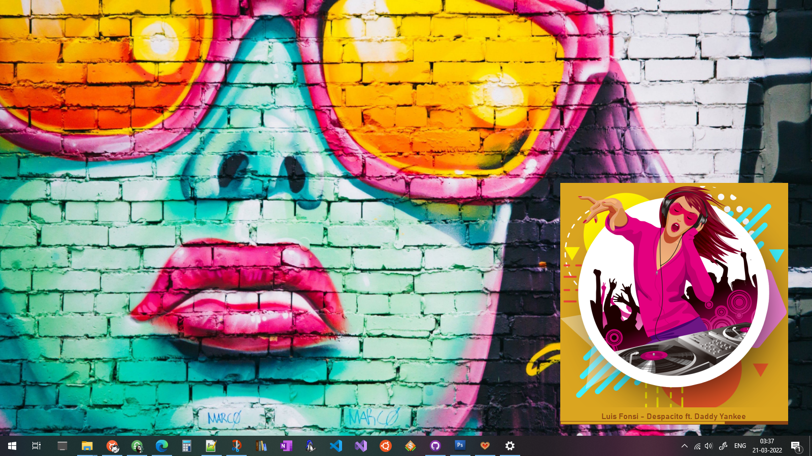
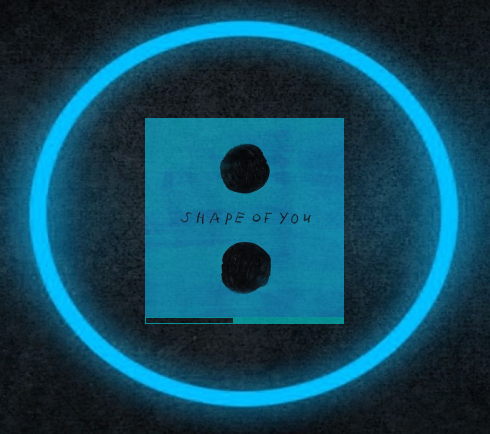

# Kookie3

> Kookie3 Media Player with un4seen BASS audio library

## About

Kookie3 is a media player based on [un4seen BASS audio library](https://www.un4seen.com/).
Supported for windows7 and above. Requires .NET framework 4.8 or above.

## Customized Interface

Kookie3 is **portable** and has **highly flexible UI**. Checkout some interface setting below.
___

**Transparent UIs with opacity control**
___

**Resize UI and Dock seekbar & art as you like**
___

**Minimal UI with only a seekbar**
___

**Multi-Line Lable with TV-style UI**
___

**Fully Transparent Docked Player**
___

**Solid Lable with transparent art**
___

**Solid Lable with solid art**
___

**Auto color matching UI**
___

**No Lable - only seekbar and album-art in UI**
___

**Full Hue shift with RGB effects** : turn on *Hue Shift* in settings
___

## Installation

Kookie3 is stand-alone, no installation required. 

* [Download](https://github.com/Nelson-iitp/Kookie3/raw/main/Kookie3/Kookie3.zip) and Extract zip

* Run `Kookie3.exe` executable, **drag-drop** files to play

___

**Note:**
* make sure BASS related dlls `bass.dll` and `Bass.Net.dll` are in the same directory as the executable `Kookie3.exe`

* on the first run, you shall be prompted to create a **default library** - click yes to create default library
	
	* you must have a default library which is just a text file `k3.lib` created under app directory
	* also, default settings file `k3.ini` will be created under app directory on first run

* After creating settings and library file, Kookie3 default interface will show up.
	* **right-click** to see alt-menu
	

* click on '**setting**' menu item to see all settings window

* '**Art/Art_Default'** can be choosen to set app background
	* some app backgrounds are provided within, check the folder `k3art` under app directory
* '**Art/Art_Always_Show_Default'** can be turned **False** to show album art when available
___

