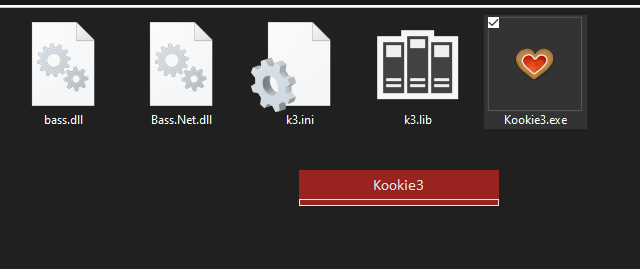

# Kookie3

> Kookie3 Media Player with un4seen BASS audio library

## About

Kookie3 is a media player based on [un4seen BASS audio library](https://www.un4seen.com/).
Supported for windows7 and above. Requires .NET framework 4.8 or above.

## Customized Interface

Kookie3 is **portable** and has minimal but **highly flexible UI**. Checkout some interface setting below.
___

**Transparent UI with opacity control**
___

**Resize UI and Dock seekbar & art as you like**
___

**Minimal UI with only a seekbar**
___

**Multi-Line Lable with TV-style UI**
___

**Fully Transparent Docked Player**
___

**Solid Lable with transparent art**
___

**Fully Solid (opaque) UI**
___

**Auto color matching UI** : Note - color matching is b/w art background and label background, this works during Hue shift as well.
___

**No Lable UI**
___

**Full Hue shift with RGB effects** : turn on *Hue Shift* in settings
___

## Installation

Kookie3 is stand-alone, no installation required. You can compile from source code or use pre-compiled binaries available in zip format.

* [Download](https://github.com/Nelson-iitp/Kookie3/raw/main/Kookie3/Kookie3.zip) and Extract zip

* Run `Kookie3.exe` executable, **drag-drop** files to play

* Press 'L' to view library and 'P' to view playlist
___

**Note:**
* make sure BASS related dlls `bass.dll` and `Bass.Net.dll` are in the same directory as the executable `Kookie3.exe`

* on the first run, you shall be prompted to create a **default library** - click yes to create default library
	
	* you must have a default library which is just a text file `k3.lib` created under app directory
	* also, default settings file `k3.ini` will be created under app directory on first run

* After creating settings and library file, Kookie3 default interface will show up.
	* **right-click** to see alt-menu
	

* click on '**Setting -> Show Configuration**' menu item to see settings window

* '**Art/Art_Default'** can be choosen to set app background
	* some app backgrounds are provided within, check the folder `k3art` under app directory
* '**Art/Art_Always_Show_Default'** can be turned **False** to show album art when available
___

## UI Controls

Kookie3 is mainly focused on quick-keyboard shortcuts but all functionality can be accessed using mouse as well.

## Mouse Controls
* seekbar can be clicked
* volume control with mouse wheel
* drag-drop to open files/folders - works on UI, Library and Playlist
* press and hold left-mouse-button to move window
* right-click to see alt-menu

## Keyboard Controls

### General

|Action----------------------------|Key----------------------------|
|:------|:------|
|Exit|Escape|
|Show Playlist|P|
|Show Library|L|
|Toggle File Drop Target|D|
|Show Settings|E|
|Show Devices|V|
|Reinitialize BASS device|Enter|
|Open App Directory|F2|
|Visit Website|F1|

### Media Control

|Action----------------------------|Key----------------------------|
|:------|:------|
|Play/Pause|Space|
|Restart|ctrl + Space|
|Next/Prev Track|Right/Left|
|Seek +/-5 seconds|shift + Right/Left|
|Seek +/-30 seconds|ctrl + Right/Left|
|Seek +/-2 minutes|ctrl + shift + Right/Left|
|Volume +/-01|Up/Down|
|Volume +/-02|shift + Up/Down|
|Volume +/-05|ctrl + Up/Down|
|Volume +/-10|ctrl + shift + Up/Down|
|Mark As Favourite|F|
|Display media information|I|

### Playlist Control

|Action----------------------------|Key----------------------------|
|:------|:------|
|Clear Playlist|ctrl + X|
|Shuffle Playlist Once|S|
|Toggle Repeat Single|R|
|Toggle Repeat All|shift + R|
|Toggle Reversed Playlist|ctrl + shift + R|

### UI Size

|Action----------------------------|Key----------------------------|
|:------|:------|
|Width +/- 5px|shift + Add/Subtract|
|Width +/- 1px|shift + Multiply/Divide|
|Height +/- 5px|ctrl + Add/Subtract|
|Height +/- 1px|ctrl + Multiply/Divide|
|X-Axis +/- 1px|ctrl + shift + Add/Subtract|
|Y-Axis +/- 1px|ctrl + shift + Multiply/Divide|

### UI Visibility

|Action----------------------------|Key----------------------------|
|:------|:------|
|Opacity +/- 5%|Add/Subtract|
|Opacity +/- 1%|Multiply/Divide|
|Toggle Hidden Label|H|
|Toggle Hidden Seekbar|ctrl + H|
|Toggle Hide in Taskbar|shift + H|
|Toggle TopMost|ctrl + T|
|Center Screen UI|ctrl + C|
|Center Screen UI if out of bounds|C|
|Auto-size UI|ctrl + B|

### Misc

|Action----------------------------|Key----------------------------|
|:------|:------|
|Toggle Hue Shift|T|
|Choose Custom Default Art|A|
|Set Color as Background|shift + S|
|Load Config Changes|ctrl + O|
|Save Config Changes|ctrl + S|
|Save As Config Changes|ctrl + shift + S|

### On Library View

|Action----------------------------|Key----------------------------|
|:------|:------|
|Close|Escape
|Clear Playlist|ctrl + X|
|Find in Library|ctrl + F|
|Find Next|F3|
|Select All|ctrl + A|
|Select None|ctrl + L|
|Toggle Grouped View|ctrl + G|
|Show Info about selected item|F1|

### On PlayList View

|Action----------------------------|Key----------------------------|
|:------|:------|
|Play Now|Enter|
|Shuffle Once |ctrl + S|
|Select All|ctrl + A|
|Select None|ctrl + L|
|Remove Selected Tracks|Delete|
|Clear Playlist|ctrl + X|
|Find in Playlist|ctrl + F|
|Find Next|F3|
|Locate Current Track|Space|

___
